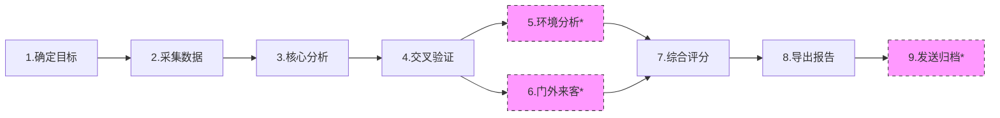

# 📊 股票综合投资分析报告生成指南

> **文档类型**：操作指导手册  
> **版本**：v1.2  
> **最后更新**：2026-04-24  
> **核心引用**：
> - 📄 报告结构：`./投资分析报告模板.md`
> - 🔄 执行流程：`./报告生成指南.md`

---

## 🔹 核心原则

```yaml
指导原则:
  - 模板驱动: 报告输出严格遵循《投资分析报告模板.md》10章框架
  - 流程闭环: 执行步骤按《报告生成指南.md》9步顺序推进
  - 数据优先: 股票数据查询首选 akshare-docs，备用源仅作降级
  - 交叉验证: 关键财务/股东数据需多源比对 + PDF原文校验
  - 风险标注: 使用 ✅⚠️🔴🟢📈🔨 等图标直观呈现状态
```

---

## 📚 文档引用说明

| 引用文档 | 用途 | 关键内容 |
|---------|------|---------|
| `投资分析报告模板.md` | 📄 报告输出标准 | 10章结构、表格格式、`{{占位符}}`规范、评分维度、免责声明 |
| `报告生成指南.md` | 🔄 执行流程标准 | 9步工作流、Skill映射表、数据源清单、验证规则、可选步骤 |
| `akshare-docs` | 🛠️ 首选数据工具 | 行情/财务/股东/分红/宏观等全品类数据接口（https://akshare.akfamily.xyz） |

> 💡 **设计说明**：本指南为「操作说明书」，不涉及具体代码实现。模板与指南作为独立资产维护，本文件仅定义「如何联动使用」。

---

## 🔄 9步工作流概览



> * 标注*为可选步骤，按需执行

---

## 📋 分步操作指引

---

### 步骤1：确定分析目标

```yaml
目标: 明确分析对象与基准日

操作清单:
  - [ ] 确认股票代码格式（如 600519/002594）
  - [ ] 确认股票简称与全称匹配
  - [ ] 设定 analysis_date 为数据截取基准日（格式 YYYY-MM-DD）

输出: 目标确认单，用于后续步骤引用

引用:
  - 模板: 报告标题区占位符 {{股票名称}}（{{股票代码}}）
  - 指南: 步骤1说明
```

---

### 步骤2：获取基础数据（并行执行 ⚡）

```yaml
目标: 多源采集8类基础数据

🔹 数据工具策略:
  首选: akshare-docs（所有股票数据查询优先调用）
  降级: 若akshare超时/缺数 → 按指南回退至备用源
  校验: 关键财务数据仍需 pdf-converter + 交易所公告 二次验证

任务清单:
```

| 数据项 | 首选（akshare-docs） | 备用源（指南原方案） | 模板对应字段 |
|--------|---------------------|---------------------|-------------|
| 基本信息/行情/估值 | `stock_zh_a_spot_em` | 雪球 + stock-analyzer | 一.1, 二.1, 五.1 |
| 财务指标（三表/季报） | `stock_financial_report_sina` | 新浪财经 + financial-health | 三.1, 三.3, 三.4 |
| 技术指标（MA/RSI/量能） | `stock_zh_a_hist` | 新浪财经 + technical-analyzer | 二.2, 八.技术面 |
| 新闻风险/舆情 | `stock_news_em` | 东方财富 + news-risk-analyzer | 六.风险因素 |
| 股东持股/十大股东 | `stock_hold_control_management_em` | 东方财富 + shareholder-analyzer | 七.股东结构 |
| ROCE/盈利能力 | `stock_financial_analysis_indicator` | 新浪财经 + roce-calculator | 八.盈利能力 |
| 分红历史 | `stock_history_dividend` | 东方财富 + a-dividend-analyzer | 五.3 |
| 市场环境（大盘PE） | `stock_market_pe_lg` | 乐咕/新浪 + market-analyzer | 五.1参考, 可选步骤5 |

```yaml
引用:
  - 指南: 步骤2 + 关键数据源表
  - 模板: 各章节占位字段
```

---

### 步骤3：核心分析建模

```yaml
目标: 基于采集数据进行四维深度分析

3.1 行情归因:
  焦点: 涨跌原因 + 板块联动验证
  方法:
    - 对比同板块个股表现（akshare: stock_board_industry_name_em）
    - 关联当日新闻/公告（akshare: stock_news_em）
  输出: 模板「二.近期行情分析」章节内容
  引用: 指南#3.1

3.2 业务拆解:
  焦点: 产能/收入/驱动因素 + 项目进展
  方法:
    - 财务数据拆解收入结构（akshare + financial-health）
    - 公告解析项目里程碑（akshare: stock_notice_report）
  输出: 模板「四.业务板块分析」章节内容
  引用: 指南#3.2

3.3 股东穿透:
  焦点: 控股股东股权穿透 + 风险核验
  方法:
    - 股权穿透：akshare + 国家企业信用信息公示系统
    - 风险筛查：中国执行信息公开网 + 裁判文书网
  输出: 模板「七.2 控股股东深度分析」
  引用: 指南#3.3 + 外部信息验证表

3.4 增减持追踪:
  焦点: 识别资金动向信号
  方法:
    - 季度持股对比（akshare: stock_hold_change）
    - 标记：陆股通🟢 / 牛散📈 / ETF🔄 / 实控人减持🔴
  输出: 模板「七.3 默默增持/减持的股东」
  引用: 指南#3.4
```

---

### 步骤4：数据交叉验证 🔐

```yaml
目标: 关键数据多源比对，确保准确性

验证规则:
  财务数据:
    - 规则: "akshare财务数据 vs PDF财报原文"
    - 工具: pdf-converter
    - 容差: "偏差≤5%，否则标注⚠️并采信审计财报"
    
  股东数据:
    - 规则: "akshare股东数据 vs 交易所公告"
    - 工具: web-search + regex
    - 优先级: "以公告披露为准"
    
  风险事件:
    - 规则: "舆情新闻需有官方来源背书"
    - 来源: [交易所公告, 证监会, 裁判文书网]
    - 动作: "无官方来源则标注🟡谨慎引用"

输出: 带验证状态标注的数据集，供报告填充使用
引用: 指南#步骤4 + 外部信息验证表
```

---

### 步骤5：市场环境分析（可选）

```yaml
启用条件: 当需评估系统性风险/行业轮动时

操作:
  - 大盘趋势: akshare: stock_zh_a_hist (上证指数) + MA20/MA50判断
  - 行业位置: akshare: stock_board_industry_hist_em + 估值分位
  - 牛熊标记: 结合乐咕市场PE分位（akshare: stock_market_pe_lg）

输出: 模板「五.估值分析」参考 + 「九.投资建议」情景设定依据
引用: 指南#步骤5
```

---

### 步骤6："门外来客"调查（可选）

```yaml
启用条件: 当关注股权变动/举牌风险时

操作:
  - 权益变动: akshare: stock_equity_hold_change + 交易所公告
  - 5%红线: 检索是否触及举牌线（regex: "权益变动报告书"）
  - 要约收购: 公告关键词匹配 + 时间线梳理

输出: 模板「七.2.6 关键发现」+「六.5 股东减持风险」补充内容
引用: 指南#步骤6
```

---

### 步骤7：综合评分计算

```yaml
目标: 6维打分，生成量化评级

评分维度（满分120）:
```

| 维度 | 满分 | 核心计算因子 | 数据来源 |
|------|------|-------------|---------|
| 盈利能力 | 20 | ROCE趋势/毛利率/扣非增速 | akshare财务接口 |
| 财务安全 | 20 | 流动比率/资产负债率/现金流 | akshare+PDF校验 |
| 估值合理 | 20 | PE分位/PB/股息率/PEG | akshare估值接口 |
| 技术面 | 20 | 均线排列/RSI/量价配合 | akshare历史行情 |
| 业务前景 | 20 | 产能确定性/市占率/壁垒 | akshare公告+行业 |
| 公司治理 | 20 | 实控人稳定/质押率/信披 | akshare+外部核验 |

```yaml
评级映射:
  A+: 108-120 | A: 96-107 | B+: 84-95 | B: 72-83 | C: 60-71 | D: <60

输出: 模板「八.综合评分」表格 +「九.投资建议」评级依据
引用: 模板#八 + 指南#步骤7
```

---

### 步骤8：报告组装导出

```yaml
目标: 按模板填充内容，生成标准Markdown

操作流程:
  1. 加载《投资分析报告模板.md》
  2. 替换所有 {{占位符}} 为步骤2-7产出数据
  3. 渲染状态图标：✅ ⚠️ 🔴 🟢 📈 🔨
  4. 附加：数据来源清单 + 标准免责声明
  5. 输出文件：{{股票名称}}_{{股票代码}}_综合投资分析报告_{{日期}}.md

质量检查清单:
  - [ ] 10章节完整无遗漏
  - [ ] 表格格式对齐模板
  - [ ] 关键数据标注来源（优先标注akshare）
  - [ ] 风险提示无缺失

引用: 模板全文 + 指南#步骤8
```

---

### 步骤9：分发与归档（可选）

```yaml
启用条件: 当需共享报告或建立知识库时

操作:
  - 邮件发送: 附件 + 摘要正文 → email-sender
  - 本地归档: 按 年份/行业/评级 建立目录结构
  - 知识入库: 关键结论结构化存入向量数据库（可选）

输出: 报告交付完成确认
引用: 指南#步骤9
```

---

## ⚙️ 质量控制规则

```yaml
质量门禁:
  数据时效:
    - 行情数据: 截止 analysis_date 15:00
    - 财务数据: 采用最新披露季报/年报（标注报告期）
    
  冲突处理:
    - 规则: "多源数据偏差>5% 时标注⚠️"
    - 优先级: 交易所公告 > 审计财报 > akshare > 备用源
    
  估值口径:
    - PE口径: 统一使用TTM，剔除非经常性损益
    - 分位计算: 基于近5年历史数据（akshare支持）
    
  风险红线:
    - 自动标记🔴: 质押率>70% / 连续两年扣非为负 / 被立案调查
    - 联动动作: 治理维度评分下调 ≥3分
    
  免责声明:
    - 位置: 报告末尾强制附加
    - 内容: 引用模板标准条款，不可修改
```

---

## 🧭 快速开始清单

```yaml
人工执行准备:
  环境准备:
    - [ ] 下载《投资分析报告模板.md》《报告生成指南.md》
    - [ ] 安装 akshare: pip install akshare
    - [ ] 准备 pdf-converter 工具（如需财务校验）
  
  执行流程:
    - [ ] 按9步顺序推进，每步勾选checklist
    - [ ] 优先调用 akshare-docs 获取股票数据
    - [ ] 关键数据执行步骤4交叉验证
    - [ ] 填充模板时严格保留Markdown表格格式
  
  交付标准:
    - [ ] 文件名符合规范：{{名称}}_{{代码}}_报告_{{日期}}.md
    - [ ] 附带数据来源清单 + 免责声明
    - [ ] （可选）邮件发送 + 本地归档
```

---

> 💡 **使用提示**  
> 1. 本指南为「操作说明书」，不涉及具体代码实现，人工/自动化均可参照执行  
> 2. `akshare-docs` 为首选数据工具，但需自行处理接口限流/异常降级  
> 3. 模板与指南作为独立资产维护，本文件仅定义「如何联动使用」  
> 4. 所有⚠️🔴标注需在报告中保留，确保风险提示可见性
