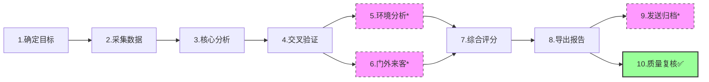

# 📊 股票综合投资分析报告生成指南

> **文档类型**：操作指导手册  
> **版本**：v1.3  
> **最后更新**：2026-04-24  
> **核心引用**：
> - 报告结构：`./investment-report-template.md`
> - 执行流程：`./report-generation-guide.md`

---

## 🔹 核心原则

```yaml
指导原则:
  - 模板驱动: 报告输出严格遵循《investment-report-template.md》10章框架
  - 流程闭环: 执行步骤按《report-generation-guide.md》9步顺序推进 + 第10步质量复核
  - 数据优先: 股票数据查询首选 akshare-docs，备用源仅作降级
  - 交叉验证: 关键财务/股东数据需多源比对 + PDF原文校验
  - 风险标注: 使用 ✅⚠️🔴🟢📈🔨 等图标直观呈现状态
  - 交付前必检: 报告生成后必须执行「缺失项复核清单」
```

---

## 📚 文档引用说明

| 引用文档 | 用途 | 关键内容 |
|---------|------|---------|
| `investment-report-template.md` | 📄 报告输出标准 | 10章结构、表格格式、`{{占位符}}`规范、评分维度、免责声明 |
| `report-generation-guide.md` | 🔄 执行流程标准 | 9步工作流、Skill映射表、数据源清单、验证规则、可选步骤 |
| `akshare-docs` | 🛠️ 首选数据工具 | 行情/财务/股东/分红/宏观等全品类数据接口（https://akshare.akfamily.xyz） |

---

## 🔄 10步工作流概览（新增步骤10：质量复核）



> * 标注*为可选步骤，按需执行  
> ✅ **步骤10为强制环节，报告交付前必须完成**

---

## 📋 分步操作指引

> 步骤1-9内容保持不变，此处仅展示新增的**步骤10**

---

### 步骤10：报告质量复核（强制✅）

```yaml
目标: 确保报告完整、准确、合规，无缺失项或格式错误

执行时机: 步骤8「报告组装导出」完成后，步骤9「发送归档」执行前

复核方式: 人工逐项勾选 + 自动化脚本辅助（可选）
```

#### 🔍 复核清单（对照《investment-report-template.md》）

```yaml
结构完整性检查:
  - [ ] 一、公司概况
    - [ ] 1.1 基本信息表格：6项字段全部填充，无{{残留占位符}}
    - [ ] 1.2 核心资产布局：业务版图图示完整，状态标注✅/🔨/⚠️齐全
  - [ ] 二、近期行情分析
    - [ ] 2.1 今日行情：走势/涨跌幅/板块三项数据完整
    - [ ] 2.2 近期股价表现：至少2个日期数据，备注说明清晰
  - [ ] 三、财务分析
    - [ ] 3.1 主要财务数据：6项指标同比变化全部计算
    - [ ] 3.2 财务数据解读：增长驱动+负面因素均有说明
    - [ ] 3.3 资产负债表：4项关键指标变化标注
    - [ ] 3.4 现金流量分析：经营现金流✅/❌状态明确
  - [ ] 四、业务板块分析
    - [ ] 4.1 核心现金牛业务：产品/产能/进展/预期四要素齐全
    - [ ] 4.2 战略储备业务：子项目数据+时间线+风险说明完整
  - [ ] 五、估值分析
    - [ ] 5.1 当前估值：PE/PB/股息率均有市场参考+🟢🟡🔴评价
    - [ ] 5.2 业绩预测：至少2年预测数据
    - [ ] 5.3 分红历史：近3年记录+变化说明
  - [ ] 六、风险因素
    - [ ] 6.1-6.5 五类风险均有内容，🔴🟡图标使用规范
  - [ ] 七、股东结构分析
    - [ ] 7.1 前十大股东表格完整
    - [ ] 7.2 控股股东深度分析：6个子项（基本信息→关键发现）无遗漏
    - [ ] 7.3 增减持分析：增持/减持/陆股通/投资启示四部分齐全
  - [ ] 八、综合评分
    - [ ] 6维度打分+总分+评级，数值逻辑自洽（总分=各维度和）
  - [ ] 九、投资建议
    - [ ] 9.1 短/中/长期建议明确
    - [ ] 9.2 关键观察指标≥2项
    - [ ] 9.3 目标价位：保守/中性/乐观三情景完整
  - [ ] 十、结论
    - [ ] 优势/劣势各≥3条，一句话总结精炼
    - [ ] 免责声明原文保留，未删改
    - [ ] 数据来源列表完整，标注akshare为主源

占位符检查:
  - [ ] 全文搜索 "{{"，确认无未替换占位符
  - [ ] 重点检查：{{股票名称}}、{{股票代码}}、{{报告日期}}、{{最新季度}}

格式规范检查:
  - [ ] 所有Markdown表格对齐，|分隔符完整
  - [ ] 状态图标使用规范：✅成功 ⚠️关注 🔴风险 🟢积极 📈趋势 🔨进行中
  - [ ] 标题层级正确：# → ## → ### 无跳级
  - [ ] 代码块/引用块语法正确，无渲染异常

数据一致性检查:
  - [ ] 财务数据：3.1/3.3/3.4 中同一指标数值一致
  - [ ] 估值数据：5.1的PE与2.1行情数据逻辑匹配
  - [ ] 股东数据：7.1持股比例合计≈100%，7.2穿透比例与7.1一致
  - [ ] 评分逻辑：八.综合评分 各维度得分与前述分析结论呼应

风险标注检查:
  - [ ] 所有🔴风险项在六.风险因素 中有对应说明
  - [ ] 治理风险（6.4）与7.2.5历史风险事件 内容一致
  - [ ] 股东减持风险（6.5）与7.3默默减持股东 数据呼应

交付物检查:
  - [ ] 文件名格式：{{股票名称}}_{{股票代码}}_综合投资分析报告_{{日期}}.md
  - [ ] 文件编码：UTF-8，无乱码
  - [ ] 附件清单：报告正文 + 数据来源说明（可选）+ 免责声明（内置）
```

#### 🛠️ 辅助工具建议（可选）

```yaml
自动化校验脚本（示例逻辑）:
  1. 占位符扫描:
     command: grep -n "{{" report.md
     expected: 无输出 或 仅允许{{免责声明}}等白名单项
     
  2. 表格完整性检查:
     logic: 统计每章表格行数，与模板预期行数比对，偏差>10%则告警
     
  3. 图标规范性检查:
     allowed_icons: ["✅", "⚠️", "🔴", "🟢", "📈", "🔨", "❌", "🔄", "🟡"]
     action: 扫描全文，发现非允许图标则标注🟡待确认
     
  4. 数值逻辑校验:
     - 综合评分总分 = SUM(6维度得分)
     - 资产负债率 = 负债合计 / 总资产（允许±1%计算误差）
     - 同比变化 = (本期-同期)/|同期|（校验计算逻辑）
```

#### 📝 复核输出

```yaml
复核结果记录:
  报告文件: {{文件名}}
  复核人: {{姓名/系统}}
  复核时间: {{时间戳}}
  
  检查结果:
    - 结构完整性: ✅/❌（如❌，列出缺失章节）
    - 占位符清理: ✅/❌（如❌，列出残留占位符）
    - 格式规范: ✅/❌（如❌，列出异常位置）
    - 数据一致: ✅/❌（如❌，列出冲突项）
    - 风险标注: ✅/❌（如❌，列出遗漏风险）
    
  处理意见:
    - [ ] 通过，可交付
    - [ ] 需修改，问题清单见附件
    - [ ] 重大缺失，建议重新生成
    
  附件: 
    - 复核问题明细表（如有）
    - 自动化校验日志（如启用）
```

#### ⚠️ 复核不通过处理流程

```yaml
if 复核结果 != "通过":
  1. 定位问题: 根据复核清单标记项，定位到具体章节/字段
  2. 分类处理:
     - 占位符未替换 → 返回步骤8重新填充
     - 数据缺失/冲突 → 返回步骤2或4重新采集/验证
     - 格式错误 → 手动修正Markdown语法
     - 逻辑矛盾 → 返回步骤7重新评分或步骤3重新分析
  3. 复测: 修改后重新执行步骤10复核
  4. 记录: 在复核结果中记录问题类型与解决方式，用于流程优化
```

---

## ⚙️ 质量控制规则（更新版）

```yaml
质量门禁:
  数据时效:
    - 行情数据: 截止 analysis_date 15:00
    - 财务数据: 采用最新披露季报/年报（标注报告期）
    
  冲突处理:
    - 规则: "多源数据偏差>5% 时标注⚠️"
    - 优先级: 交易所公告 > 审计财报 > akshare > 备用源
    
  估值口径:
    - PE口径: 统一使用TTM，剔除非经常性损益
    - 分位计算: 基于近5年历史数据（akshare支持）
    
  风险红线:
    - 自动标记🔴: 质押率>70% / 连续两年扣非为负 / 被立案调查
    - 联动动作: 治理维度评分下调 ≥3分
    
  免责声明:
    - 位置: 报告末尾强制附加
    - 内容: 引用模板标准条款，不可修改
    
  🔹 新增：交付前复核:
    - 强制步骤: 步骤10质量复核必须执行并记录结果
    - 通过标准: 复核清单全部✅，或❌项已修复并复测通过
    - 留痕要求: 复核结果记录随报告归档，便于审计追溯
```

---

## 🧭 快速开始清单（更新版）

```yaml
人工执行准备:
  环境准备:
    - [ ] 下载《investment-report-template.md》《report-generation-guide.md》
    - [ ] 安装 akshare: pip install akshare
    - [ ] 准备 pdf-converter 工具（如需财务校验）
    - [ ] （可选）准备复核辅助脚本
  
  执行流程:
    - [ ] 按1-9步顺序推进，每步勾选checklist
    - [ ] 优先调用 akshare-docs 获取股票数据
    - [ ] 关键数据执行步骤4交叉验证
    - [ ] 填充模板时严格保留Markdown表格格式
    - [ ] 【新增】执行步骤10质量复核，填写复核结果记录
  
  交付标准:
    - [ ] 文件名符合规范：{{名称}}_{{代码}}_报告_{{日期}}.md
    - [ ] 附带数据来源清单 + 免责声明
    - [ ] 【新增】附复核结果记录（通过/修改后通过）
    - [ ] （可选）邮件发送 + 本地归档
```

---

> 💡 **使用提示**  
> 1. 本指南为「操作说明书」，不涉及具体代码实现，人工/自动化均可参照执行  
> 2. `akshare-docs` 为首选数据工具，但需自行处理接口限流/异常降级  
> 3. 模板与指南作为独立资产维护，本文件仅定义「如何联动使用」  
> 4. 所有⚠️🔴标注需在报告中保留，确保风险提示可见性  
> 5. 🔹 **步骤10质量复核为强制环节，未经复核的报告不得交付**
