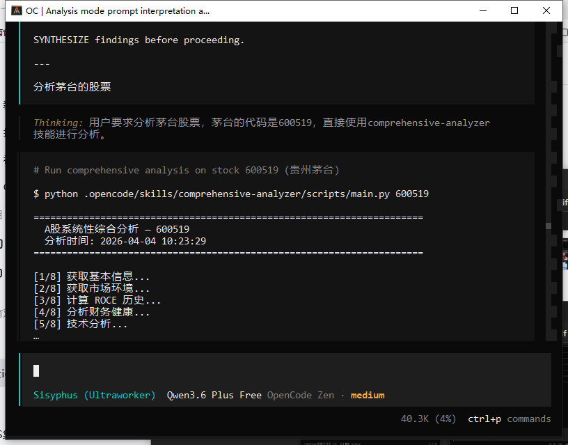
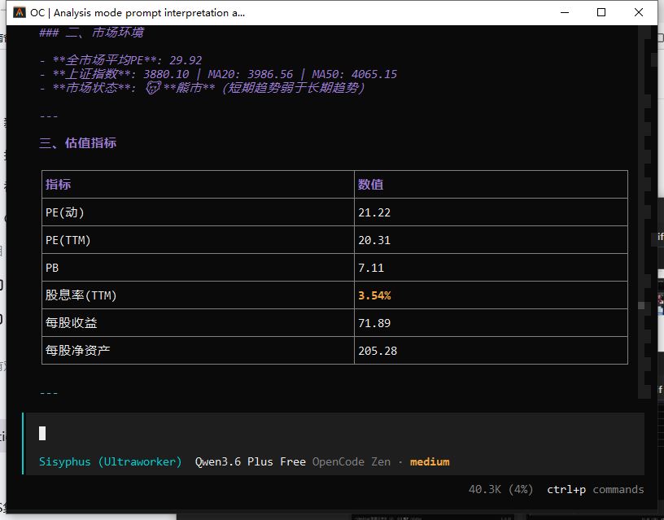
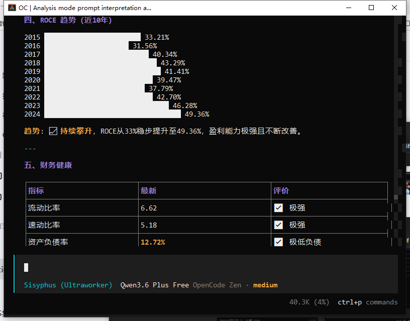
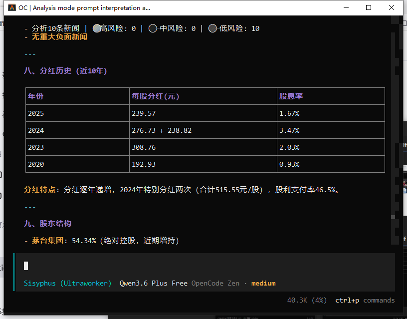
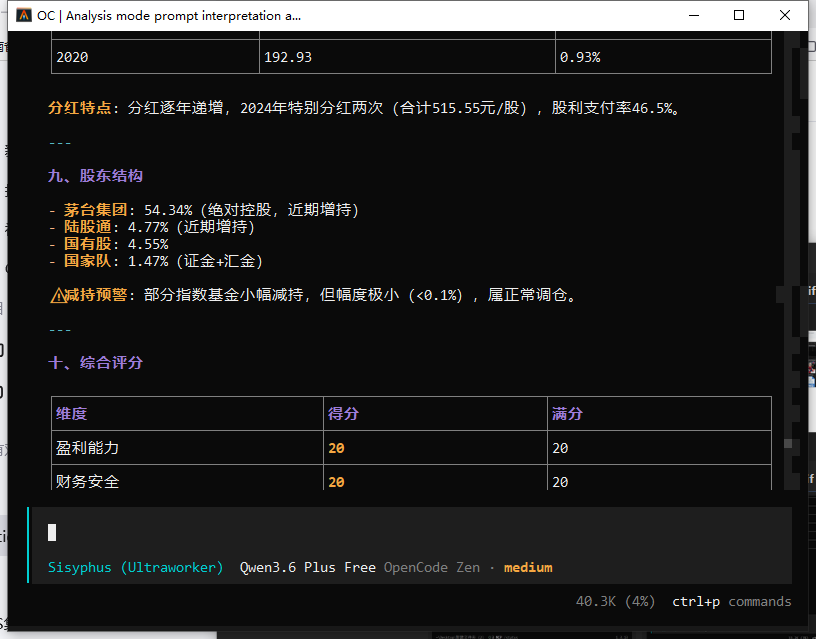
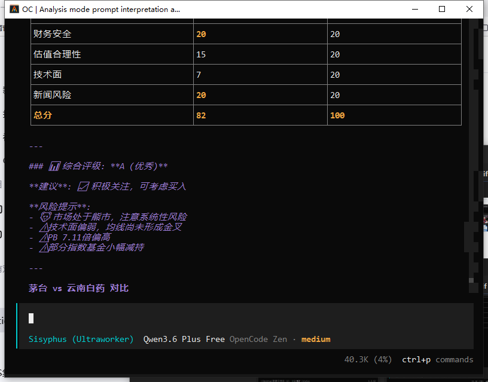
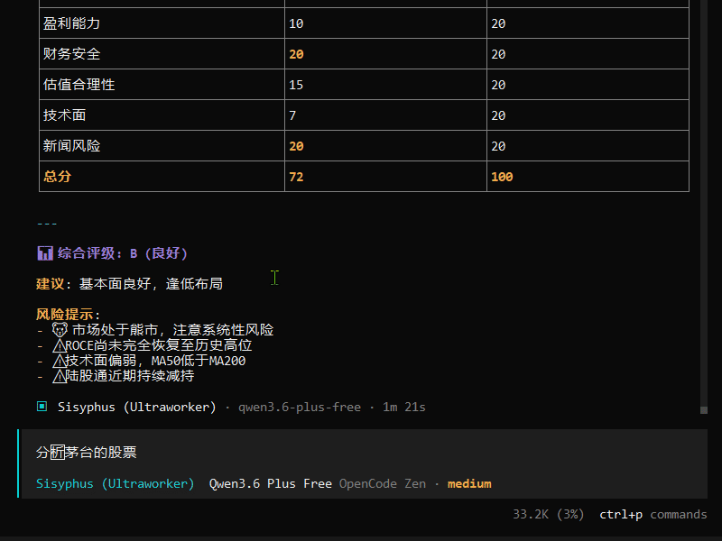

# A 股股票分析 Skill 集

基于 akshare 数据源的 A 股多维度分析 OpenCode Skills，覆盖 **基本面分析** + **技术面分析** + **新闻风险评估** + **综合评分** 四大维度。

---
## 演示








---

## 特性

- 🎯 **9 个独立 Skill**：可按需单独使用，也可一键输出完整报告
- 🔗 **共享核心架构**：所有 Skill 统一引用 `core/` 核心逻辑层，保证数据一致性与零代码重复
- 📊 **5 维评分体系**：盈利能力 / 财务安全 / 估值合理性 / 技术面 / 新闻风险，满分 100 分
- 📡 **多数据源融合**：雪球（实时行情）+ 新浪财经（财务报表/K线）+ 东方财富（新闻/分红）+ 乐咕（市场PE）
- 🐍 **纯 Python 实现**：无需额外服务，命令行即可运行

---

## 包含 Skill

| Skill | 功能 | 输入 | 核心模块 |
|-------|------|------|----------|
| `comprehensive-analyzer` | 一键输出 10 章节完整投资报告 | 股票代码 | 全部 |
| `report-exporter` | 将分析数据导出为 Markdown 报告文件 | 股票代码 | `core/report.py` |
| `roce-calculator` | 近 10 年 ROCE（资本回报率）趋势 | 股票代码 | `core/roce.py` |
| `financial-health` | 财务健康指标（流动比率/速动比率/负债率/ROE/自由现金流） | 股票代码 | `core/financial.py` |
| `market-analyzer` | A 股市场整体状况（平均PE/上证指数MA20/MA50/牛熊判断） | 无 | `core/market.py` |
| `stock-analyzer` | 个股估值 + 行业分析（PE/PB/股息率） | 股票代码 | `core/stock.py` |
| `technical-analyzer` | 技术指标分析（MA50/MA200 金叉死叉 + RSI14） | 股票代码 | `core/technical.py` |
| `news-risk-analyzer` | 新闻风险评估（诚信风险/经营风险关键词检测） | 股票代码 | `core/news.py` |
| `a-dividend-analyzer` | A股分红配送（送转/现金分红/股息率/股权登记日/除权除息日） | A股代码 | `core/a_dividend.py` |

---

## 目录结构

```
stock-analyzer-skills/
├── .opencode/
│   └── skills/
│       ├── core/                           # 核心逻辑层（所有 skill 共享）
│       │   ├── __init__.py                 #   统一导出所有函数
│       │   ├── roce.py                     #   ROCE 计算（EBIT / 投入资本）
│       │   ├── financial.py                #   财务健康（流动比率/速动比率/负债率/ROE/自由现金流）
│       │   ├── technical.py                #   技术分析（MA 均线 + RSI）
│       │   ├── stock.py                    #   个股估值（PE/PB/股息率/行业）
│       │   ├── market.py                   #   市场分析（市场PE + 上证指数趋势）
│       │   ├── news.py                     #   新闻风险（诚信风险/经营风险关键词匹配）
│       │   ├── dividend.py                 #   分红历史（A股每股分红/股息率/送转比例）
│       │   ├── a_dividend.py               #   A股分红配送（送转/现金分红/股息率/关键日期）
│       │   ├── scorer.py                   #   综合评分（5 维度评分 + A-E 评级）
│       │   └── report.py                   #   报告导出（数据→Markdown 格式）
│       ├── comprehensive-analyzer/         # 综合分析 Skill
│       │   ├── SKILL.md
│       │   └── scripts/
│       │       └── main.py                 #   薄封装 → from core import *
│       ├── roce-calculator/                # ROCE 计算 Skill
│       │   ├── SKILL.md
│       │   └── scripts/main.py
│       ├── financial-health/               # 财务健康 Skill
│       │   ├── SKILL.md
│       │   └── scripts/main.py
│       ├── market-analyzer/                # 市场分析 Skill
│       │   ├── SKILL.md
│       │   └── scripts/main.py
│       ├── stock-analyzer/                 # 个股分析 Skill
│       │   ├── SKILL.md
│       │   └── scripts/main.py
│       ├── technical-analyzer/             # 技术分析 Skill
│       │   ├── SKILL.md
│       │   └── scripts/main.py
│       └── news-risk-analyzer/             # 新闻风险 Skill
│           ├── SKILL.md
│           └── scripts/main.py
│       └── report-exporter/                # 报告导出 Skill
│           ├── SKILL.md
│           └── scripts/main.py
│       ├── a-dividend-analyzer/            # A股分红配送 Skill
│           ├── SKILL.md
│           └── scripts/main.py
└── README.md
```

### 架构原则

| 层级 | 职责 | 说明 |
|------|------|------|
| `core/` | 数据获取 + 计算逻辑 | 返回结构化数据（dict/DataFrame），不含任何格式化输出 |
| `scripts/main.py` | 参数解析 + 格式化输出 | 薄封装层，仅做 `from core import ...` 调用和结果展示 |
| `comprehensive-analyzer` | 组合编排 | 组合所有 core 模块，不重复任何计算代码 |

---

## 安装方式

### 前置依赖

```bash
pip install akshare pandas
```

### 方式 1：全局安装（本机所有 OpenCode 项目可用）

**Windows**：
```cmd
mklink /D "%USERPROFILE%\.config\opencode\skills\stock-analyzer" "C:\Users\Lenovo\Desktop\stock-analyzer-skills"
```

**Linux/macOS**：
```bash
ln -s /path/to/stock-analyzer-skills ~/.config/opencode/skills/stock-analyzer
```

### 方式 2：项目级安装（仅当前项目可用）

将整个 `.opencode/` 目录复制到目标项目根目录：

```bash
cp -r stock-analyzer-skills/.opencode /path/to/target-project/
```

### 方式 3：Git 子模块（推荐团队使用）

```bash
git submodule add <仓库URL> .opencode/skills/stock-analyzer
```

---

## 使用方式

### OpenCode 调用

在 OpenCode 对话中直接调用 Skill：

```
skill(name="comprehensive-analyzer")
skill(name="roce-calculator")
skill(name="financial-health")
skill(name="market-analyzer")
skill(name="stock-analyzer")
skill(name="technical-analyzer")
skill(name="news-risk-analyzer")
skill(name="a-dividend-analyzer")
```

### 命令行运行

```bash
# 综合分析（推荐：一键输出完整报告）
python .opencode/skills/comprehensive-analyzer/scripts/main.py 600519

# 单独使用各 Skill
python .opencode/skills/roce-calculator/scripts/main.py 600519
python .opencode/skills/financial-health/scripts/main.py 600519
python .opencode/skills/market-analyzer/scripts/main.py
python .opencode/skills/stock-analyzer/scripts/main.py 600519
python .opencode/skills/technical-analyzer/scripts/main.py 600519
python .opencode/skills/news-risk-analyzer/scripts/main.py 600519 20
python .opencode/skills/a-dividend-analyzer/scripts/main.py 600519
```

### 快速上手

```bash
# 最快的方式：一行命令获取贵州茅台完整分析报告
python .opencode/skills/comprehensive-analyzer/scripts/main.py 600519
```

---

## 输出示例

### comprehensive-analyzer 报告结构

| 章节 | 内容 | 数据源 |
|------|------|--------|
| 一、基本信息 | 股票名称 / 现价 / 涨跌幅 / 总市值 / 所属行业 | 雪球 |
| 二、估值指标 | PE(动/静/TTM) / PB / 股息率 / 每股收益 / 每股净资产 | 雪球 |
| 三、ROCE | 近 10 年资本回报率趋势（ROCE + 净利润 + EBIT + 投入资本） | 新浪财经 |
| 四、财务健康 | 流动比率 / 速动比率 / 资产负债率 / ROE / 自由现金流 | 新浪财经 |
| 五、技术分析 | MA50 / MA200 金叉死叉信号 + RSI(14) | 新浪财经 |
| 六、新闻风险 | 高/中/低风险新闻统计 + 诚信风险预警 | 东方财富 |
| 七、分红历史 | 近 10 年每股分红 / 股息率 / 送转比例 | 东方财富 |
| 八、综合评分 | 5 维度评分（各 20 分）+ 综合评级（A-E） | 综合计算 |
| 九、投资建议 | 基于评分的买卖建议 + 风险提示 | 综合计算 |

### 综合评分体系

| 维度 | 满分 | 评估内容 | 评分逻辑 |
|------|------|---------|---------|
| 盈利能力 | 20 | ROCE 绝对值 + 趋势 | ROCE >20% 得 20 分；趋势恶化（近 3 年降 >50%）扣 5 分 |
| 财务安全 | 20 | 流动比率 + 资产负债率 | 流动比率 >2 加 6 分；<0.5 扣 6 分；负债率 <30% 加 4 分 |
| 估值合理性 | 20 | PE 水平 | PE <15 得 20 分；15-25 得 15 分；25-40 得 10 分；>40 得 5 分 |
| 技术面 | 20 | MA 均线信号 + RSI | 金叉 +5 分；死叉 -3 分；超卖 +3 分；超买 -3 分 |
| 新闻风险 | 20 | 负面新闻数量 | 有诚信风险得 5 分；有经营风险得 12 分；无风险得 20 分 |

| 总分 | 评级 | 建议 |
|------|------|------|
| 80-100 | A 优秀 | 积极关注，可考虑买入 |
| 65-79 | B 良好 | 基本面良好，逢低布局 |
| 50-64 | C 一般 | 观望为主，等待更好时机 |
| 35-49 | D 较差 | 风险较高，谨慎对待 |
| 0-34 | E 危险 | 回避，风险过大 |

**评分特点**：
- ROCE 趋势恶化自动扣分（近 3 年下降 >50%）
- 流动比率权重加倍（短期偿债能力是关键风险）

---

## 各 Skill 详细说明

### roce-calculator

计算股票近 10 年 ROCE（Return on Capital Employed，资本回报率）。

**核心公式**：
```
ROCE = EBIT / 投入资本
投入资本 = 总资产 - 流动负债
EBIT = 净利润 + 利息费用 + 所得税
```

**ROCE 参考标准**：

| 范围 | 评价 |
|------|------|
| > 20% | 优秀 |
| 15% - 20% | 良好 |
| 10% - 15% | 一般 |
| < 10% | 较差 |

### financial-health

分析股票财务健康状况，输出近 5 期财报的关键指标。

**输出指标**：
- **流动比率**：>2 良好 | >1.5 一般 | <1 较差
- **速动比率**：>1 良好 | >0.8 一般
- **资产负债率**：<50% 安全 | 50%-70% 警戒 | >70% 危险
- **ROE**：>15% 优秀 | >10% 良好 | <5% 较差
- **利息覆盖率**：>3 安全 | <1.5 危险
- **自由现金流**：经营现金流 - 资本支出

### market-analyzer

分析 A 股市场整体状况，无需输入股票代码。

**输出内容**：
- 全市场平均市盈率（乐咕数据）
- 上证指数 MA20 / MA50
- 牛熊判断：MA20 > MA50 → 牛市 | MA20 < MA50 → 熊市

### stock-analyzer

获取个股实时行情和估值数据。

**输出指标**：
- 股票名称 / 所属行业 / 现价 / 涨跌幅
- PE(动/静/TTM) / PB / 股息率(TTM)
- 总市值 / 每股收益 / 每股净资产
- 基于 PE 和涨跌幅的买卖建议

### technical-analyzer

分析股票技术指标。

**输出指标**：
- **MA 均线系统**：MA50 / MA200 金叉（Bullish）或死叉（Bearish）
- **RSI(14)**：>70 超买 | <30 超卖 | 30-70 中性

### news-risk-analyzer

获取个股新闻并进行关键词风险评估。

**风险等级**：

| 等级 | 说明 |
|------|------|
| 🔴 高风险 | 财务造假、监管处罚、诚信问题、立案调查等 |
| 🟡 中风险 | 业绩下滑、股东减持、行业政策变化、高管辞职等 |
| 🟢 低风险 | 日常经营、正面新闻等 |

**诚信风险关键词**（30+ 个）：财务造假、虚增利润、虚假记载、财务舞弊、信披违规、证监会调查、行政处罚、内幕交易、操纵股价、退市风险警示 等。

### a-dividend-analyzer

获取A股历年分红配送详情，分析分红连续性和送转/现金分红情况。

**输出内容**：
- 历年分红表格（报告期/预案公告日/股权登记日/除权除息日/方案进度/送转/现金分红/股息率/每股指标/净利润同比）
- 详细每股指标（每股公积金/每股未分配利润/总股本/送股比例/转股比例）
- 分红连续性分析（现金分红年份/送股年份/转股年份/平均股息率/连续性评价）

**送转类型**：
- 送股：用未分配利润转增股本，需缴税
- 转股：用资本公积金转增股本，不缴税
- 现金分红：直接向股东派发现金

---

## 数据源

| 数据源 | akshare 函数 | 用途 |
|--------|-------------|------|
| **雪球** | `stock_individual_spot_xq()` | 个股实时行情、PE/PB/股息率 |
| **新浪财经** | `stock_financial_report_sina()` | 三大财务报表 |
| **新浪财经** | `stock_zh_a_daily()` | 历史 K 线数据 |
| **东方财富** | `stock_news_em()` | 个股新闻 |
| **东方财富** | `stock_fhps_detail_em()` | A股分红送配数据 |
| **东方财富** | `stock_hk_dividend_payout_em()` | 港股分红派息数据 |
| **乐咕** | `stock_market_pe_lg()` | 市场整体 PE |
| **新浪** | `stock_zh_index_daily()` | 上证指数日线 |

---

## 注意事项

1. **东方财富接口不稳定**：`stock_zh_a_spot_em()` 和 `stock_zh_a_hist()` 经常连接超时，本项目优先使用新浪和雪球数据源
2. **财务报表列名**：新浪数据源返回中文列名，内部使用 `safe_get_col()` 模糊匹配
3. **ROCE 计算**：仅取年报（12 月 31 日），排除季报
4. **新闻过滤**：泛市场新闻（"板块"、"概念股"、"主力资金"）不参与个股风险评估
5. **网络请求**：所有数据来自在线接口，需要网络连接；部分接口有频率限制，建议调用间隔 >3 秒

---

## 常见问题

**Q: 运行时报错 "ModuleNotFoundError: No module named 'core'"？**  
A: 确保 `main.py` 所在目录的上两级目录包含 `core/` 文件夹。`main.py` 通过 `sys.path.insert(0, os.path.join(os.path.dirname(__file__), "..", ".."))` 自动添加路径。

**Q: 财务分析报错 "Expecting value: line 1 column 1"？**  
A: 新浪财经接口偶尔返回非 JSON 响应，属于数据源问题，稍后重试即可。

**Q: ROCE 计算很慢？**  
A: ROCE 需要逐年获取财务报表（每年 2 张表），10 年数据需要 20 次网络请求，请耐心等待。

**Q: 如何添加新的分析维度？**  
A: 在 `core/` 下新建模块（如 `core/my_analysis.py`），然后在 `core/__init__.py` 中导出函数，最后在对应 skill 的 `main.py` 中调用即可。

---

## 许可证

MIT
